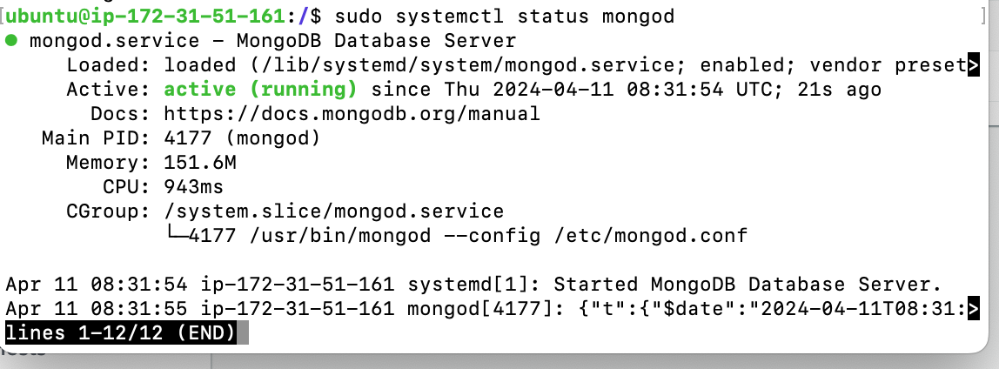
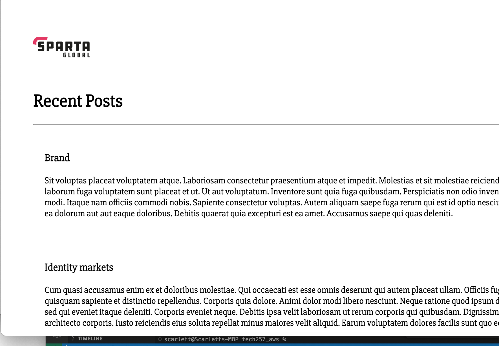
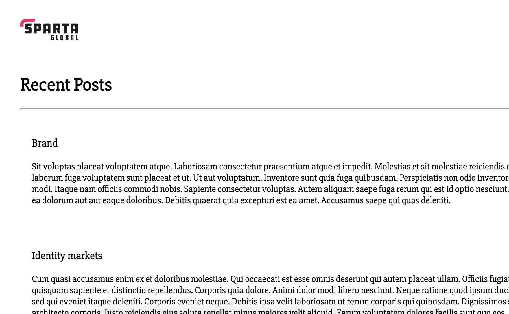

DB AMI:

Before creating the ami I created a working db instance, and tested it.

**firstly, creating a working db instance**

please note this is on `ubuntu lts 22.04`
user data used:


```
#!/bin/bash
 
# to avoid restarts
sudo nano /etc/needrestart/needrestart.conf
 
# change the line to 'a' from 'i' - Check this works!
sudo sed -i "s/#\$nrconf{restart} = 'i';/\$nrconf{restart} = 'a';/g" /etc/needrestart/needrestart.conf
 
# Update & upgrade
sudo apt update -y
sudo DEBIAN_FRONTEND=noninteractive apt-get upgrade -y
 
sudo DEBIAN_FRONTEND=noninteractive apt-get install gnupg curl -y
 
curl -fsSL https://www.mongodb.org/static/pgp/server-7.0.asc | sudo gpg -o /usr/share/keyrings/mongodb-server-7.0.gpg --dearmor
 
echo "deb [ arch=amd64,arm64 signed-by=/usr/share/keyrings/mongodb-server-7.0.gpg ] https://repo.mongodb.org/apt/ubuntu jammy/mongodb-org/7.0 multiverse" | sudo tee /etc/apt/sources.list.d/mongodb-org-7.0.list
 
sudo apt-get update -y
 
# Install Mongo DB 7.0.5 (rather than just the latest version). However, you might install the latest version initially as it does work.
# This has an error
# sudo apt-get install -y mongodb-org=7.0.5 mongodb-org-database=7.0.5 mongodb-org-server=7.0.5 mongodb-mongosh=7.0.6 mongodb-org-mongos=7.0.5 mongodb-org-tools=7.0.5
 
# Install the latest version
sudo apt-get install -y mongodb-org
echo "mongodb-org hold" | sudo dpkg --set-selections
echo "mongodb-org-database hold" | sudo dpkg --set-selections
echo "mongodb-org-server hold" | sudo dpkg --set-selections
echo "mongodb-mongosh hold" | sudo dpkg --set-selections
echo "mongodb-org-mongos hold" | sudo dpkg --set-selections
echo "mongodb-org-tools hold" | sudo dpkg --set-selections
 
# Install Mongo DB
# Configure Mongo DB's bindIp to be 0.0.0.0 (accept connections from anywhere)
sudo sed -i 's@127.0.0.1@0.0.0.0@' /etc/mongod.conf
# Make sure Mongo DB service is started + enabled
sudo systemctl daemon-reload
sudo systemctl enable mongod
sudo systemctl start mongod


```

## testing

**1** I got it running and checked in `root` with a `sudo systemctl status mongod`



**2** I then tested it in app by adding ip address to the user data through environment variable.



## Create an AMI for the db

To create an AMI, first you must have an instance with the db running on it.

1. Then on the instance click actions > Images and templates > create Image.

2. Begin to name istance and give a description in Image name and Image description

to get get more details on how to create an ami click here: [AMI documentation](https://github.com/Scarlett100/tech257_aws/blob/master/AMI.md) 

## Create an instance from db AMI

User data for db new instance from ami needs no user data


## testing with app instance made from app ami

To test I put this user data in this app ami made you will notice I have added the db variable:


```
#!/bin/bash
 
# Navigate to the app directory from user data
cd /tech257-sparta-app/app

export DB_HOST=mongodb://<db_private_ip>:27017/posts
 
pm2 stop all
 
# Use pm2 to start app and ensure it runs in the background
pm2 start app.js --name "sparta-test-app"

```

## It worked!


