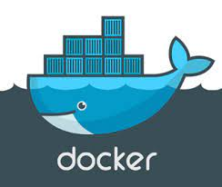
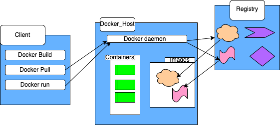

##  Docker

- [What is docker](#what-is-docker)
  - [How to run an image](#how-to-run-an-image)
  - [How to run the Nginx Image specifically](#how-to-run-the-nginx-image-specifically)
  - [How to check the container id](#how-to-check-the-container-id)
  - [How to check a container has ran](#how-to-check-a-container-has-ran)
  - [To stop an container](#to-stop-an-container)
  - [To start an aleady existing stopped container](#to-start-an-aleady-existing-stopped-container)
  - [To delete a container:](#to-delete-a-container)
  - [How to view all containers:](#how-to-view-all-containers)
- [Entering a container](#entering-a-container)
  - [To enter container:](#to-enter-container)
  - [Get machine name](#get-machine-name)
  - [Install dependencies](#install-dependencies)
  - [How to get to nginx file:](#how-to-get-to-nginx-file)
  - [Install nano and edit html file](#install-nano-and-edit-html-file)
  - [To exit container](#to-exit-container)
  - [To create my own image:](#to-create-my-own-image)
  - [Find an image](#find-an-image)
  - [How to tag an image](#how-to-tag-an-image)
  - [Push image to docker hub to create repo](#push-image-to-docker-hub-to-create-repo)
  - [Run the image](#run-the-image)
  - [Working](#working)
- [Containerise northwind app](#containerise-northwind-app)
  - [Check the image is there:](#check-the-image-is-there)
  - [Working image](#working-image)
  - [Using docker on the sparta test app](#using-docker-on-the-sparta-test-app)
- [References](#references)


#  What is docker





Docker is an open source platform for creating, shipping, testing, deploying and running applications. With Docker it is possible to isolate applications from the infrastructure you have configured, this allows for software to be delivered rapidly. The speed of Docker means that the time spent between writing code and deploying an app to production is  decreased significantly. In Docker, infrastructure is managed the same way applications are. 

Multiple containers running are called microservices, docker is faster than a vm.

Below we can see the architecture:

<br>




## How to run an image 
```
docker run hello-world
```

## How to run the Nginx Image specifically
connect port 80 of my client to port 80 of my image. p is for ports d is for detached mode
```
 docker run -d -p 80:80 nginx
 ```

## How to check the container id

```
 docker ps
```
## How to check a container has ran

**1.** Go to `localhost` on browser to see:


## To stop an container
```
`docker stop` <container_id>
```


## To start an aleady existing stopped container
note: to start, we will be back where we left off anything previously on a container will be there.

`docker start` <container_id>


## To delete a container:

```
docker rm <container_id> -f
```

**note**: safer to stop it then remove:

```
`docker stop` <container_id>
docker rm <container_id>
```

<br>
As you can see below, the container has been removed.


## How to view all containers:

```
docker ps -a
```

# Entering a container

## To enter container:

* it is interactive mode
* sh is shell
```
docker exec -it d6fad36d83aa sh
```


**Once inside**

## Get machine name 
```
uname -a
```

## Install dependencies
```
apt-get update -y
apt-get upgrade -y
apt-get install sudo
```


## How to get to nginx file:


```
# pwd
/
# cd /usr
# pwd
/usr
# cd /share
sh: 8: cd: can't cd to /share
# cd share
# pwd
/usr/share
# cd nginx
# pwd
/usr/share/nginx
# cd html
# pwd
/usr/share/nginx/html
# 
```


ls
cat index.html

## Install nano and edit html file

sudo apt-get install nano
sudo nano index.html


so quick!


## To exit container 

just click `exit`.


```
docker run -d -p 90:80 <container_id> image name


docker run -d -p 80:80 nginx
```

## To create my own image:

I need to create an image of the nginx container so that I have my own image, to do this I need to save changes on new image, using a commit command and the container id. I also made a few extra html text changes (not necessary,  just exploring)

```
docker commit b57b620c3e12 
``` 

## Find an image

To find image as you have not added a tag it will be marked as `none` unless you tag it.

```
docker images -a 
```


## How to tag an image
```
docker tag 4930b8f9436a scarlett100/tech257morgan
```
## Push image to docker hub to create repo
```
docker push scarlett100/tech257morgan
```


## Run the image
run (i put 250 as it was unlikely to be a port in use)

```
docker run -d -p 250:80 scarlett100/tech257morgan
```

## Working


# Containerise northwind app
First I had to make a docker file which can be found here [dockerfile](https://github.com/Scarlett100/docker_1/blob/master/app_northwind/DOCKERFILE) and add the [requirements.txt](https://github.com/Scarlett100/docker_1/blob/master/app_northwind/requirements.txt) in order too 

Structure wise, I placed them within the same place as the app python file  `northwind_web.py` sat. [northwind app](https://github.com/LSF970/northwind_python_app)

Once built my [dockerfile](https://github.com/Scarlett100/docker_1/blob/master/app_northwind/DOCKERFILE) I had to build the image so it would run.

```
"docker build --tag northwind_app ."
```


## Check the image is there:


```
docker images -a
```


Then to see the app I had to go too

```
docker run -p 5000:5000 northwind_app
```
You will get this notification.

```
# INFO:waitress:Serving on http://0.0.0.0:5000
```
##  Working image

You can see it works!


Then to push to my hub I did the following:

```

docker ps
docker commit 4a641ece470a scarlett100/northwind_app:northwind_app

docker push scarlett100/northwind_app:northwind_app

```
As you can see below it is now in my hub:


## Using docker on the sparta test app

Here is the link to my [dockerfile](https://github.com/Scarlett100/tech257-sparta-app/blob/master/app2/Dockerfile). 


I had to make sure the correct things were installed including:

* node 20
* npm

**2.** Next I ran:

```
docker build --tag sparta_test_app . 
```
**2.** Once done I ran the container
```
docker run -d -p 3000:3000 sparta_test_app 
```

but got an error saying the port wa allocated so i testes on 100:3000

and was able to see the test app 


**3.** Next I commited my container

```
 docker commit a07c8b85a159 scarlett100/sparta_test_app_no_p:sparta_test_app_no_p
 ```
 I then pushed the changes to my docker hub
 ```
 docker push scarlett100/sparta_test_app_no_p:sparta_test_app_no_p   
 ```

 As you can see it is in my hub
 **4.**

```
docker run -d -p 100:3000 sparta_test_ap
```
Blocker:

Things that were not straightforward although expected to be straightforward.


* pm2
* vscode
  


# References
https://www.freecodecamp.org/news/how-to-dockerize-a-flask-app/


