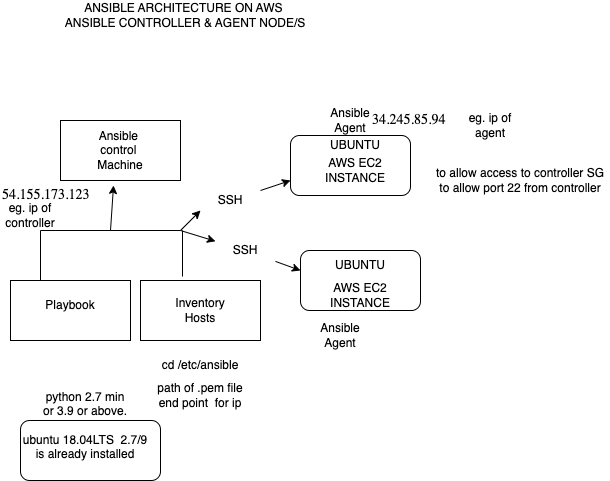

# IAC

## What

Infrastructure as code (IaC) allows you to  have the infrastructure using code as opposed to manually setting things up. Developers are constantly maintain, update and create infrastructure ti run tests, develop applications and then deploy them. IaC makes it wasy to tear the infrastructure down, or spin up quickly,

## Why 

As DevOps Engineers we want to achieve automation. IaC helps us to do this by builiding environments. With Iac we can easily duplicate an environments infrastructure, once it has been built correctly, more importantly, we can do this quickly and easily with Iac, without having to combine manual work and scripts. Due to these quick start ups, we can also reduce config errors, and we can roll back to previous working environments. Lastly Iac allows  for continuos improvments, now that something works, we can easily apply something else tat will improve the process.

## When do we use Iac:

We can use Iac for the following:
*   speedy setup of any new environments (whether development or production)
*   We an use Iac for scalability to scale up or down depending on requirements and demand.
*   Iac can be used to integrate with Cloud services.

## where

In AWS we can use IAC with services such as:
*   Cloud Formation
*   Software Development Kit

## Tools

*   Terraform
*   Ansible
*   Puppet
*   Chef

## Benefits of ansible 
Ansible is an open-source software provisioning, configuration management, and application-deployment tool.

its benefits are:

*   YAML is the chosen language to write playbooks, as it is easy to read and understand. This means you can get started in Ansible very quickly.
*   Ansible is very powerful. We can spin up thousands of nodes at any time, one playbook can be run on many instance.. 

This is largely due to the fact that Ansible is agentless:

Requirements are minimal for Ansible installation.
Not Linux exclusive
Ansible works with existing tool kits
Uses high quality protocols (SSH and WinRM) to connect to hosts.


## Who is using ansible

* DevOps Engineers


playbook >AWScontrol machine(ec2)




To create our controller and agent nodes we must make 2 instances

a controller and an app agent, both need port 22 open.

once both are created ssh into the controller node:

and run the following commands:
``` 
# update
sudo apt update -y

# upgrade
sudo DEBIAN_FRONTEND=noninteractive apt-get upgrade -yq

# install software properties
sudo apt-get install software-properties-common

# Add ansible repo
sudo apt-add-repository ppa:ansible/ansible

# run another update
sudo apt-get update -y

#  install ansible
sudo apt-get install ansible

# check you have ansible
ansible --version


# Go to config file location
cd /etc/ansible


We need to use hosts file to make agent vm a

# Cd ~/.ssh

sudo vim tech257.pem    #(copy paste pem file details over) (In Mac remove percentage sign for pem file, if you didn't already scp the pem file)

# sudo chmod 400 "tech257.pem"

``` 
# AGENT VM
In the **controller vm** ssh into **agent vm** via the .ssh folder.
make sure you are in 
``` 
~/.ssh
``` 
Also be sure to add sudo in front of ssh command:
``` 
eg.
sudo ssh -i "tech257.pem" ubuntu@ec2-<ip_address>.eu-west-1.compute.amazonaws.com
``` 
Check sensible not there by running
``` 
ansible --version
``` 

Exit vm by running:
```  
exit
``` 

# Back to controller!

We now open up a host file that is present but we cannot see.

``` 
cd /etc/ansible
sudo nano hosts
``` 
Add 2  line below:
``` 
[web]
ec2-instance ansible_host=<AGENT_IP_ADDRESS> ansible_user=ubuntu ansible_ssh_private_key_file=~/.ssh/<NAME_OF_PEM_FILE>.pem
``` 
In this case ours would be:

``` 
[web] <--this is the group I have called it
ec2-instance ansible_host=34.245.85.94 ansible_user=ubuntu ansible_ssh_private_key_file=~/.ssh/tech257.pem
``` 

Now, if we run a:
``` 
sudo ansible all -m ping
``` 
Now we have to **verify our connection**: should get 


Then run
``` 
sudo ansible web -a "uname -a"
``` 
The output should be:


To copy over our pem file to agent node,we run:
```
sudo ansible web -m ansible.builtin.copy -a "src=~/.ssh/tech257.pem dest=~/.ssh
```


check nginx is infact running:
```
sudo ansible web -a "systemctl status nginx"
```


npm start on agent app:


app is working!


Currently running into issues when trying to stop npm process and start in background.


to reconfigure 

when ip changes, 

*   go to hosts change ip, give ip instance different name eg ec2 db, ec2 app
*   make sure new instamce is in new group.
*   to note db had public ip used.
*   then run:
*   


```
sudo ansible all -m ping
```
As you can see all are working.


# Getting db up and running, Mongodb through playbooks:


first we had to make a yaml file in controller:


then run:

```
sudo ansible-playbook mongo.yml
```

then I ran into errors. so from the Controller i had to run an update and upgrade on the db vm: 

```
sudo ansible db -a "sudo apt-get update -y"
sudo ansible db -a "sudo apt-get upgrade -y"
```

Once that was sorted I ran the command again and 
```
sudo ansible-playbook mongo.yml
```

It was successful!


Next I ran, to check mongo db was running on db vm:


```
sudo ansible db -a "systemctl status mongodb"
```


From controller ssh into db vm:

* go to cd /etc
* sudo nano mongodb.conf
* change bind ip to all 0's and uncomment port
* 
* 

* to do in a mongo db script 
add:


```
---
- name: Configure MongoDB to accept connections from anywhere by setting bindIp to 0.0.0.
  ansible.builtin.command: sudo sed -i 's@127.0.0.1@0.0.0.0@' /etc/mongod.conf

- name: Uncomment the port configuration in MongoDB configuration file
  ansible.builtin.command: sudo sed -i 's/#port/port/' /etc/mongod.conf

- name: Modify ~/.bashrc to export DB_HOST variable
  ansible.builtin.command: |
    sudo echo 'export DB_HOST="mongodb://[PublicIP]:27017/posts"' >> ~/.bashrc

- name: Source the ~/.bashrc file to apply changes
  ansible.builtin.command: source ~/.bashrc


```


Now here is the full mondodb playbook:

```
---
# creating playbook to install mongo bd
- hosts: db
  gather_facts: yes
  become: true
  tasks:
    - name: installing Mongodb in the db server
      apt:
        pkg: mongodb
        state: present

    - name: Configure MongoDB to accept connections from anywhere by setting bindIp to 0.0.0.
      ansible.builtin.command: sudo sed -i 's@127.0.0.1@0.0.0.0@' /etc/mongod.conf

    - name: Uncomment the port configuration in MongoDB configuration file
      ansible.builtin.command: sudo sed -i 's/#port/port/' /etc/mongod.conf

    - name: Modify ~/.bashrc to export DB_HOST variable
      ansible.builtin.command: |
        sudo echo 'export DB_HOST="mongodb://[PublicIP]:27017/posts"' >> ~/.bashrc

    - name: Source the ~/.bashrc file to apply changes
      ansible.builtin.command: source ~/.bashrc
```
As you can see it is working, I did manually seed db with 
```
node seeds/seed.js 
```
and start app manually
```
Npm start 
```


# final files:

here is a final pasting of working files:


## NGINX.yml

```
---

#where do you want to install the playbook 
- hosts: web
# would you like to see the logs
  gather_facts: yes

# provide admin access to this playbook - use sudo
  become: true
#instructions - tasks. install nginx in agent node
  tasks:
  - name: configure/install nginx on agent node
    apt: pkg=nginx state=present

```


## app.yml


```
---
# where do you want to install or run this playbook?
- hosts: web

  # would you like to see the logs?
  gather_facts: yes

  # provide admin access to this playbook - use sudo
  become: true

  # instructions - tasks install nodejs in agent node
  tasks:
    - name: Update apt package cache
      apt:
        update_cache: yes

    - name: Ensure any held broken packages are resolved
      command: sudo dpkg --configure -a
      ignore_errors: yes
      changed_when: false

    - name: Fix held broken packages
      command: sudo apt-get install -f -y
      ignore_errors: yes
      changed_when: false

    - name: Install Node.js using curl and bash
      shell: curl -fsSL https://deb.nodesource.com/setup_17.x | sudo -E bash - && sudo apt-get install -y nodejs
      args:
        executable: /bin/bash

    - name: clone repo
      git:
        repo: https://github.com/Scarlett100/ci_cd_again.git
        dest: /home/ubuntu/ci_cd_again
        clone: yes
        update: yes

    - name: change directory to app
      shell: cd /home/ubuntu/ci_cd_again/app

    - name: Install app dependencies using npm
      shell: npm install
      args:
        chdir: /home/ubuntu/ci_cd_again/app

    # command to run npm in the background
    - name: Start the application in the background
      ansible.builtin.shell: nohup npm start > /dev/null 2>&1 &
      args:
        chdir: /home/ubuntu/ci_cd_again/app

```
## mongo.yml


```
# creating playbook to install mongo bd
---

 # where would you like to install db
- hosts: db

 #logs required
  gather_facts: yes

 # allow admin access
  become: true

 # add instruction tasks
  tasks:
  - name: installing Mongodb in the db server
    apt: pkg=mongodb state=present
  - name: Configure MongoDB to accept connections from anywhere by setting bindIp to 0.0.0.
    ansible.builtin.command: sudo sed -i 's@127.0.0.1@0.0.0.0@' /etc/mongodb.conf

  - name: Uncomment the port configuration in MongoDB configuration file
    ansible.builtin.command: sudo sed -i 's/#port/port/' /etc/mongodb.conf

  - name: Modify ~/.bashrc to export DB_HOST variable
    ansible.builtin.command: |
      sudo echo 'export DB_HOST="mongodb://[PublicIP]:27017/posts"' >> ~/.bashrc
  - name: Source the ~/.bashrc file to apply changes
    ansible.builtin.shell: source ~/.bashrc
    ignore_errors: yes
```


manually it is ok to run these 2 commands:

node seeds/seed.js < ideall try and add to mongo playbook

Npm start <—do manually