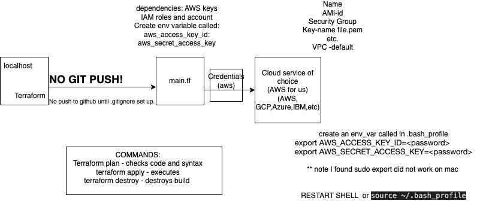

# <center> Terraform <center/>




## What is it
Terraform allows you to control your infrastructure on a cloud service provider. It has only a few main commands and is incredibly easy to spin up and tear down architecture.
<br>


``` 
Main commands (preceeded by "Terraform"):
  init          Prepare your working directory for other commands
  validate      Check whether the configuration is valid
  plan          Show changes required by the current configuration
  apply         Create or update infrastructure
  destroy       Destroy previously-created infrastructure
  ``` 

#### Terraform Workflow:


## Why use it:

*   Manage any infrastructure
  Terraform generates a plan and prompts you for your approval before modifying your infrastructure. It also keeps track of your real infrastructure in a state file, which acts as a source of truth for your environment.

*   Track your infrastructure
   Terraform  keeps track of your real infrastructure in a state file, which acts as a single source of truth for your environment.
  
*   Automate changes
  Automate your workflow to maximise teams, and outputs. Working on changes as and when.
  


*   Standardise configurations
  One way of working that can easily be reffered back too

*   Collaborate
  incorporaing version control makes for easy collaboration.


## who is using it in the industry

The big providers are:

* AWS
* Azure
* GCP

Users include
* Deutsche Bank
* Rover
* Canva
* Staffbase

 ##what is orchestration with Terraform IaC:
 managing and coordinating deployments/operations of multiple services/applications in environments.


 First we moved our access keys we are given from downloads to .ssh with

 ``` 
 mv ~/Downloads/<ACCESS_KEY_NAME>.csv  ~/.ssh/<ACCESS_KEY_NAME>.csv
 ```

https://phoenixnap.com/kb/set-environment-variable-mac

First we must export the env variables and make them persistent,

by doing the following:
```
sudo nano .bash_profile
```
Scroll down to the end of the .bash_profile file.
export [variable_name]=[variable_value]

```
source ~/.bash_profile
```

## Getting started

Now navigate to terraform repo  in same terminal (must be in same shell otherwise faced issues, even though persistant).
next we need to create a file called ` main.tf ` .

## main.tf plan

Within ` main.tf ` it is best to first plan our steps.
<br>
Our plan looked like the below.
<br>
*   Create an ec2 instance
*   Where to create - provide cloud name
*   Which region to use to create a resource/service
*   Which service
*   Which AMI ID. ami = "ami-02f0341ac93c96375"
*   What type of instance to launch
*   Please add a public ip to this instance
*   aws_access_key = as env variables so not hardcoded
*   aws_secret_key = as env variables so not hardcoded
* Name the service
*   Syntax of hashicorp language is name {key = value}


# Create ec2 instance
Once planned we can make a file:
we made two blocks:


## Terraform Init

After doing this we run a `terraform init`.

<br>


After this we can now continue:


## Terraform Plan

Once this is filled out as above we run a `terraform plan`

<br>


## Terraform Apply
After this run a `terraform apply` 
<br>


If you go to AWS you will notice your aws ec2 infrastructure appear and is running, like below!


## Terraform Destroy
Now to delete this all through terraform you can do a `terraform destroy`.
<br> 
you can see below it is shutting down on aws.

<br>
Now it is fully destroyed.
<br>


**Note**: You will have to give user input for these commands in the form of "Yes".


next we want to create a git ignore to make sure that doesn't go to our github.

we wanted to connect to pem key  file so I added key by doing:

```
key_name = "tech257"
```
Next I had to add the security group, which had the rules:

to allow port 22 from localhost

allow port 3000 from all

allow port 80 from all


resource "aws_security_group" "tech257-morgan_terraform_sg" {
  name = "tech257-morgan_terraform_sg"
 ```
  ingress {
    from_port   = 22
    to_port     = 22
    protocol    = "tcp"
    cidr_blocks = ["0.0.0.0/0"]
  }
 
  ingress {
    from_port   = 3000
    to_port     = 3000
    protocol    = "tcp"
    cidr_blocks = ["0.0.0.0/0"]
  }
 
  ingress {
    from_port   = 80
    to_port     = 80
    protocol    = "tcp"
    cidr_blocks = ["0.0.0.0/0"]
  }
 
}
```

## Current vs desired state in terraform:
In Terraform, the desired state refers to the configuration you've defined in your Terraform files, outlining how you want your infrastructure to be structured. On the other hand, the current state reflects the actual state of your infrastructure as recorded in the Terraform state file. For example, your file may say create an instance, but you may have gona and manually deleted the instance you created.

## Push Method:
In the push method, the controlling server takes charge and sends configurations and files directly to the destination system. It's like the controlling server is pushing the updates to the destination system, much like sending a package through the mail. This is usually done using SSH, a secure communication protocol.

## Push Method Tools: 
Tools like Terraform, AWS CloudFormation, Ansible, and Pulumi operate using the push method by default. They send configurations and files directly to the target systems.

## Pull Method:
In contrast, with the pull method, the destination system itself is responsible for fetching its configurations and files from a central location, usually the controlling server. It's like the destination system is pulling the updates it needs, similar to how you might download files from the internet onto your computer. This is typically done using an agent installed on the destination system, which regularly checks for updates and pulls them as needed.

## Pull Method Tools:
 On the other hand, tools like Chef and Puppet follow the pull method. They rely on agents installed on the target systems to fetch configurations and files from a central server.


## Variables

add to .gitignore, so files are locally available, but push the rest to github as it gets hidden.


## automate the process of creating a repo on github

To create a repo in github called `multi-provider-terraform`, I first had to go to github and create a new personal access token to allow authentication from github. once this was done and copied somewhere, I added it to my github script to create a repo as seen below. I put the `token` as a variable after testing it once to ensure it stays private. Below you can see my script and below that you can see my repo was made!


I then ran a `terraform plan` and a `terraform apply` and went over to my github account where my new repo was visible:


## References
* https://phoenixnap.com/kb/set-environment-variable-mac <br>
* https://www.encora.com/insights/differences-between-infrastructure-as-code-iac-tools-used-for-provisioning-and-configuration-management#:~:text=Push%20vs%20Pull&text=For%20the%20pull%20method%2C%20the,CloudFormation%2C%20Ansible%2C%20and%20Pulumi <br>
* https://www.linkedin.com/pulse/github-repository-create-terraform-anish-kumar/
* https://medium.com/@vijayalakshmiyvl/how-to-create-github-repository-using-terraform-cd2d4d204605


one of the key benefitsa of ansible: resuable

now we should just be able to get endpoint 

on ansible we don't want to push the aws keys or ssh file.pem