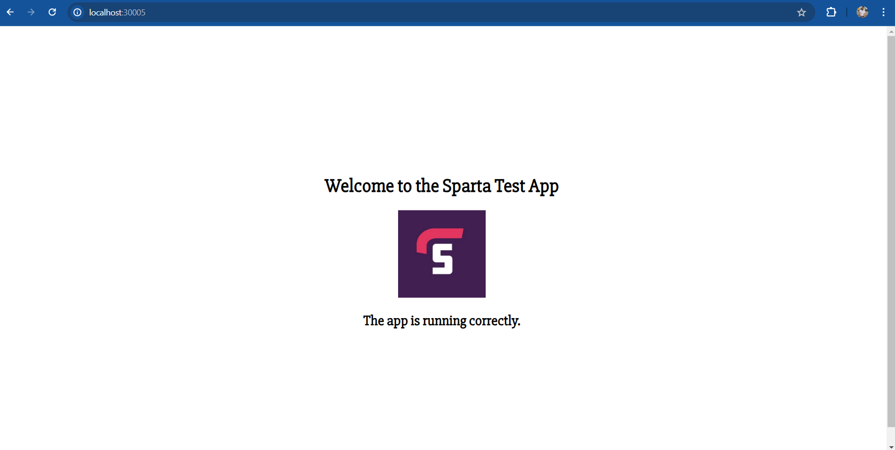

# kubernetes 


Kubernetes, also known as K8s, is an open-source system for automating deployment, scaling, and management of containerized applications.

It groups containers that make up an application into logical units for easy management and discovery. Kubernetes builds upon 15 years of experience of running production workloads at Google, combined with best-of-breed ideas and practices from the community.
To use kubernetes we must be able to have  docker installed.

microservices vs monolith.

<still to do>


We build separate images for the app and the database, so therefore, multiple microservices and use kubernetes to orchestrate this and make it highly available, scalable and durable. K8's has self healing, it can heal itself. 

Each business must look at the business needs to decide which is better for you.

Kubernetes can do these things

* self healing
* load balancing and service discovery


Once on docker hub want to scale self heal etc but docker cannot do this( so you use docker compose, swarm, kubernetes etc)

3 certainties:

* I want to use docker 

* I want to create a deployment

* I need to create a label so easily found

Creating pods:

```
apiVersion: apps/v1
kind: Deployment
metadata:
  name: nginx-deployment  # naming the deployment
spec:
  replicas: 3  #3 pods
  selector:
    matchLabels:
      app: nginx
  template:
    metadata:
      labels:
        app: nginx
    spec:
      containers:
      - name: nginx
        image: scarlett100/tech257morgan:latest
        ports:
        - containerPort: 80

```

run:

```
kubectl create -f nginx-deploy.yml
```


run:
```
kubectl get pods
```


## Delete

```
kubectl delete pod `id`
```

automantically managed
when one is deleted

 # Nginx 

the files can be found here 
[nginx-deploy](https://github.com/Scarlett100/DevOps_tech257/blob/master/kubernetes/nginx-deploy.yml)
[nginx-service](https://github.com/Scarlett100/DevOps_tech257/blob/master/kubernetes/nginx-service.yml)

 # sparta app deployment

 The files can be found here 
[Sparta-app-deploy](https://github.com/Scarlett100/DevOps_tech257/blob/master/kubernetes/node_app/app-deploy.yml)
<br>

[Sparta-app-service](https://github.com/Scarlett100/DevOps_tech257/blob/master/kubernetes/node_app/app-service.yml)

I created the service then the deploy and ran these commands

```
kubectl create -f app-deploy.yml  
kubectl create -f app-service.yml      
```
.png>)
.png>)


I saw this on browser



# kubernetes cluster


Create and deploy and service for Mongodb 
create an env Var inside node-deploy to connect to mongodb on port 27017
create service, run it
do a kubectl get service
get the ip of service 
now you can update the deploy (or start) and add ip en var to the bottom.

 The files can be found here:
[db-service](https://github.com/Scarlett100/DevOps_tech257/blob/master/kubernetes/node_app/db-service.yml)

<br>

[db-deploy](https://github.com/Scarlett100/DevOps_tech257/blob/master/kubernetes/node_app/db-deploy.yml)


To seed the db:

```
kubectl exec -it <pod name> -- node seeds/seed.js
```
However, I am having mac issues and my db just keeps timing out so I could not seed.

.png>)


# Kubernetes autoscaling

```
apiVersion: autoscaling/v1
kind: HorizontalPodAutoscaler #(hpa)

metadata:
  name: sparta-db-deploy  # naming the deployment
  namespace: default

spec:
  maxReplicas: 9 # (max num of replicas)
  minReplicas: 3 # (min num of replicas)
  scaleTargetRef: #  Targets the node deployment
   apiVersion: apps/v1
   kind: Deployment
   name: mongodb-data

  targetCPUUtizationPercentage: 50 # 50% of CPU Useage


```


Before running, do a :

```
kubectl get svc
```
Once done, delete the services you no longer need it (ie the deployments previously built)

```
kubectl delete svc <name of service>
```

So now we will execute the file that creates a volume that needs to use a mongo deployment that will will then be exposed by the  mongo service that will then be scalable. Once you deploy the file using `kubectl create -f <name of file> you will see the below.


