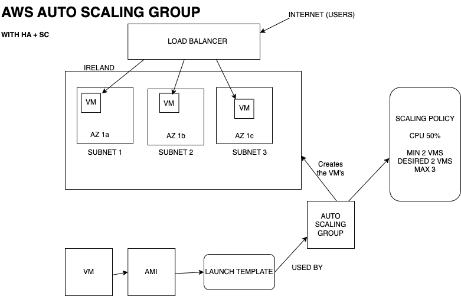

# <centre>  How to setup HA-SC with AWS (autoscaling) <centre/>

- [  How to setup HA-SC with AWS (autoscaling) ](#--how-to-setup-ha-sc-with-aws-autoscaling-)
  - [Create launch template](#create-launch-template)
  - [Test launch template works: Launch an instance](#test-launch-template-works-launch-an-instance)
- [Create an Auto scaling group](#create-an-auto-scaling-group)
- [Check Auto scaling Group](#check-auto-scaling-group)
- [Delete infrastructure](#delete-infrastructure)
- [Notes](#notes)





How we will achieve high availability and scalability:

**Scalability** :

As you can see in my diagram within the scaling policy  the maximum vm's is set to 3, whilst the desired and minimum is set to 2 . when there is peak useage it can scale up and increase capacity to 3 machines or remain at 2 when demand is normal.

**High Availability** : 

Also with my diagram is 3 vm's in 3 different availability zones, AWS is balancing the workload evenly across each AZ. Having each vm in a different az ensures that if one az goes down, there are 2 other vm's, in 2 other az's to fail over too, therefore achieving high availability.


## Create launch template

We will launch a template based off an AMI I created previously. If you wish to see the AMI this was built on click here: [AMI documentation](https://github.com/Scarlett100/tech257_aws/blob/master/AMI.md) 

**1.** `Application and OS Images (Amazon Machine Image) > my ami`


**2.** `Instance type >t2.micro`

**3.** `Network settings> choose existing security group`

**4.** Do **not** specify the subnet becausewe do not want everything in the same subnet, we will configure this in the ASG when we give a subnet to each AZ to ensure high availabilty. In launch templates we cannot do this. Your subnet determines your AZ.

**4.** Add user data.

**5.** do not add tags at this point.

add user data as below:
```
#!/bin/bash
 
# Navigate to the app directory from user data
cd /tech257-sparta-app/app
 
pm2 stop all
 
# Use pm2 to start app and ensure it runs in the background
pm2 start app.js --name "sparta-test-app"

````


## Test launch template works: Launch an instance

To test the launch template works we will create a vm from the instance.

*1.* Click on your newly created launch template and choose the below


you will notice everything you previously set is there

*2.* Add a tag this time: set the `key` as *"Name"* and the `value` as whatever you choose to name it.


*3* Click `launch` & you will eventually can see instance has been created:


*4.* We can now see test worked:


# Create an Auto scaling group


Amazon EC2 Auto Scaling assists in maintaining availability and allows you to scale your instance capacity automatica in or out.

**1.** Navigate to `Auto Scaling Groups > Create Auto Scaling Group` and input a name and pick a and click `next`


**2.** Next pick these for network:


**3.** Load Balancing


**4.** Attach a new load balancer


**5.** Target Group
A target group is a group of vm's to be targeted by the load balancer. 


**6.** Turn on Elastic Load Balancing health checks.


**7.** Keep grace at 300 seconds.

**8.** Health checks


**9.** Configure Scaling


**10.** Maintanance Policy `Prioritize Availability`


**11.** `Add Tags` to your resources I called mine `tech257-morgan-app-asg-HA_SC` for easy reference, this will name the vm's that will be spun up.


**12.** Click `Create Auto Scaling Group`


# Check Auto scaling Group


**1.** Go to `auto scaling group > load balancer > click on the load balancer tg> then on that click on load balancer > finally get the dns `


we can also see our target group is healthy:


**2.** put dns into url and we have deployment!


**3.** we can see it is creating 2 extra instances called `tech257morganappagain-asg-lb`


**4.** When I delete an instance:
another one initialises


# Delete infrastructure

Please delete in this order to avoid errors.

**1.** Navigate to `load balancer` 
<br>
**2.** Filter to your load balancer and delete

**3.** Navigate to `target groups` <br>
**4.** Filter to your target group and delete

**5.** Navigate `auto scaling group` <br>
**6.** Filter to your target group and delete


# Notes
To view ami this was built on click here: [AMI documentation](https://github.com/Scarlett100/tech257_aws/blob/master/AMI.md) 