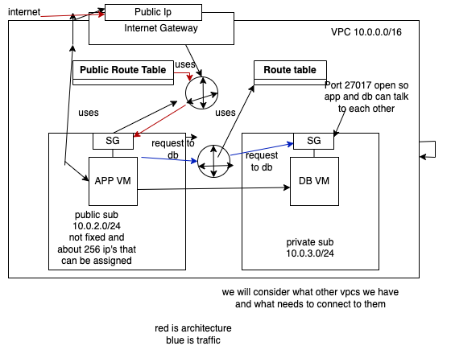

# 2 tier deployment with a custom vpc

- [2 tier deployment with a custom vpc](#2-tier-deployment-with-a-custom-vpc)
    - [VPC](#vpc)
- [why do I want to create a VPC](#why-do-i-want-to-create-a-vpc)
  - [Using a vpc to increase security in a 2 tier deployment.](#using-a-vpc-to-increase-security-in-a-2-tier-deployment)
    - [1. Create a vpc](#1-create-a-vpc)
    - [2. Create subnet](#2-create-subnet)
    - [3. Create Internet gateway](#3-create-internet-gateway)
    - [4. Attach Internet gateway to vpc](#4-attach-internet-gateway-to-vpc)
    - [5. Create route tables](#5-create-route-tables)
    - [6. ASSOCIATE SUBNETS](#6-associate-subnets)
    - [7. ASSOCIATE ROUTES](#7-associate-routes)
    - [8. checking](#8-checking)
    - [9. Launch db instance from db ami](#9-launch-db-instance-from-db-ami)
    - [10 launch app instance from app ami](#10-launch-app-instance-from-app-ami)
    - [11. Delete](#11-delete)
- [References](#references)


### VPC

In Amazon Virtual Private Cloud (Amazon VPC), AWS resources are launched in your own isolated virtual network within the cloud, similar to a traditional network within an on premise data center. AWS gives you a default VPC however, utilising this shared infrastructure on a public cloud may compromise your security and may not be what you need, therefore, you also have the option to make your own vpc. We can think of a VPC like an apartment within a hugh apartment building which represents AWS cloud, it is your private space with furniture inside. A shared apartment, would be considered as the default VPC whilst the 3 rooms within it would be the default subnets linked to different availabilty zones. A seperate apartment has seperate security. A Custom VPCs will isolate your resources from the outside vpcs and the internet (public) and in turn provide a more secure environment and network. We ultimately determine traffic flow and define security groups.


This previously mentioned furniture includes 
* Virtual Machines
* Subnets
* Route tables
* internet gateways
* security groups
* etc

The benefits of a vpc are:
* Scalability
* Isolation
* High Availabilty


To note, when we create a vm, we specify a vpc, so its important to create your vpc first if you dont want to work with the default given. 


# why do I want to create a VPC
## Using a vpc to increase security in a 2 tier deployment.


My VPC will isolate my resources and therefore, increase security for my two-tier deployment.


A default VPC is a public VPC, designed to make it easy to get going with AWS services such as an EC2. It has an internet gateway and public subnets with a corresponding route table. So, it's useful you only need publicly accessible resources or new to aws. 

<br>
However, I need to keep parts of my network private, my database should not be publically accessible. So, I will create my own to get the setup I need, its more complicated than using the default, but its more secure.


During the creation of my own VPC I shall:
* create subnets
* create a route table
* create an internet gateway
* Associate resources with one another

By creating this VPC I shall gain control over my network environment with the assurance that my resources are only accessible within the defined network perimeters therefore, enhancing overall security for my two tier deployment.  


I will have to work hard to make the VPC to make our resources public because it is naturally set up that when I create my own vpc by default, everything is private, I have to work hard to make something public.

eg. the default route table that will be connected to our private subnet  will be for traffic internal to our network, 

If you use the default vpc everything is publically acessible. However, the moment you create your own vpc everything is private already, until you put all the pieces in place. And connect those those pieces to make something public.


Up until now, I've been doing the deployment of my app and database in the default already provided virtual network which is called a Virtual Private Cloud or VPC in aws. 

The problem is that by default everything is public when you put it inside the default vpc, 

To solve this problem I needed to make my database private, the public shouldn't be accessing my database only the app should be able to access the database.


How I went about solving this:

I created my own vpc, with the benefit being that by default everything is private inside of my custom vpc until I put things in place to make things public.


So what I needed was an entryway, I needed a way to get into my VPC. So I needed an internet gateway to do that.

I needed something to have the routing rules. A rule that stated how does the traffic/people get from the gateway door/entrypoint on the outside of my vpc to my app, which is public. This is what a Route table is for. It will contain that rule of how to get to the doorway all the way to the public subnet (public room). Only place the traffic can go, from the door to the public room(living room?) as stated in the rule.


public subnet: 

private subnet with db in it is like a bedroom that you don't want anyone to get too, there is no route through the vpc to get from the outside of the vpc  to the private subnet. thats how it stays private.

we have only set up a route from the outside to the public.

Whats there by default, thats there as private, why its private


At its core and most basic a vpc can be understood as below as noted by: *AWS*.
<br>


### 1. Create a vpc

As we want to use our own vpc to ensure better security, we must first make one. Much like a house, you work outside - in, getting the foundations correct before everything else.


Here is the complete configuration we want:




**1.1** In the console search `vpc` then click `create vpc`.


**1.2** We need a specific configuration so choose `vpc only`.


**1.3** Next, be sure to set the CIDR block as **10.0.0.0/16**


**1.4** Add a `name tag` and click `create`. As you can see below the vpc has now been created.


**1.5** As you can see below we have our VPC, but now need to mov onto our subnets!


### 2. Create subnet

Subnets are a range of IP addresses within your VPC. Like a network within a network or a tiny room within your vpc. When using aws resources are created in specific subnets, eg. a database EC2 may be created in a private subnet to avoid inbound internet access.
High availibity, previously mentoned as a benefit of VPC'S can be achieved through subnets by putting each subnet into different availibilty zones and therefore deploying resources in different AZ's to avoid downtime if a single az is down. Subnets cannot be spread across AZ's and must therefore be placed in **one** AZ.


**2.1** Navigate to `subnets` on the left hand pane or put it in the interface search bar.

**2.2** Filter for your vpc name.


**2.3** **Public Subnet**: zone 1a for public and IPv4 subnet CIDR block   `10.0.2.0/24 `. This will allow us 256 possible IP addresses.


**2.4** Then click `add new subnet`


**2.5** **Private Subnet**: zone 1b for private and IPv4 subnet CIDR block  `10.0.3.0/24`


**2.6** Click `create`

subnets are created!


### 3. Create Internet gateway

We needed to create an internet gateway and attach it to our VPC. An internet gateway gives us a target to pinpoint in our VPC route tables for internet-routable traffic. It will allow public subnet resources to connect to the internet and also allows the internet resources to connect to resources within the subnet, assuming the ip address is public much  like when we are enabled to connect to an EC2 instance in AWS using your local computer, this is the work of an internet gateway.


**3.1** Name your gateway


### 4. Attach Internet gateway to vpc

**4.1**Choose your previously created VPC.
<br>


<br>

**4.2** As you can see below the `state` is now attached.

<br>


### 5. Create route tables

Route tables contains routes, that are basically a set of rules that decide where network traffic from our subnets or gateway are directed too.
we now need route tables to route through to the subnet. 
Our private subnet uses a default private route table, that will look after the request from the app to the db, so we will not need to create one for this, whilst our public will use a custom one that we will now create.
The default route table that has been created by aws for the private subnet will allow resources within the vpc to be able to communicate with each other.

**5.1** navigate to `route tables` and click `create`.


**5.2** Note: It knows the address space for the vpc as visible below:


### 6. ASSOCIATE SUBNETS

As previously noted the private subnet will utilise the default route table. Therefore, we are only required to associate the public subnet with the custom route table.

**6.1** please note: **VERY IMPORTANT TO CHOOSE PUBLIC!!** as we do not want to expose db.


### 7. ASSOCIATE ROUTES

Now we must add a route to the route table so that there is a link between our public subnet and our previously made internet gateway so that internet-bound traffic is correctly directed to its *target* the internet gateway from the public subnet. 

eg. the traffic from the internet will be directed by the route to the internet gateway to the public ip of the instance (the app in our case)


**7.1** Within your route table click edit routes and then click add route.

**7.2** select `internet gateway` and select  your internet gateway. 

**7.3** make sure the cidr block is set too `0.0.0.0/0`


### 8. checking

When all completed we can go to `vpc` and view a visual representation of what we have created and the diagram should look like this:

* A VPC
* Public subnet that links to thr custom route table
* Private subney that links to the defaut route table.
  
*note*: Green circle on public subnet means it is associted with an **internet gateway**. You will also notice the AZ zone it is placed in is marked.
<br>

 *note*: The blue icon next to the private subnet notes the letter of the availability zone it is in, the *default route table is tied to this az.


<br>
If you notice, with what has been created there is only internal traffic to private subnet.


### 9. Launch db instance from db ami
now launch an instance from db ami 

note: for details on how I created this ami [click here for DB AMI documentation](https://github.com/Scarlett100/tech257_aws/blob/master/DB_AMI.md)

**9.1** **important** on `network` click `edit` 

**9.2** choose your own `vpc` and choose `disable` for `Auto-assign public IP` as we **do not** need a public ip.


**9.3** 
add security group that enables `port 22`  for SSH and `port 27017` for mongodb


**9.4 ** 10.0.2.0/24 (our public subnets ipv4 as source to ensure connectivity)


**9.5 ** once done click  `launch instance`


### 10 launch app instance from app ami


note: for details on how I created this ami [click here for APP AMI documentation](https://github.com/Scarlett100/tech257_aws/blob/master/AMI.md) 

**10.1** choose your own `vpc` and choose `enable` for `Auto-assign public IP`


**10.2** add security group that enables `port 22`  for SSH and `HTTP` `port 80` for mongodb


 **10.3** Within the user data put the folowing:

 To note we added npm install to ensure seeding, but when tested without it, it also worked.

```
#!/bin/bash
 
# Navigate to the app directory from user data
cd /tech257-sparta-app/app

export DB_HOST=mongodb://10.0.3.229:27017/posts

# adding npm install for safety
npm install
pm2 stop all
 
# Use pm2 to start app and ensure it runs in the background
pm2 start app.js --name "sparta-test-app"
```

It works!


### 11. Delete

* ms
* sg
* vpc (deletes subnet,rt,etc)


# References
https://docs.aws.amazon.com/vpc/latest/userguide/what-is-amazon-vpc.html
